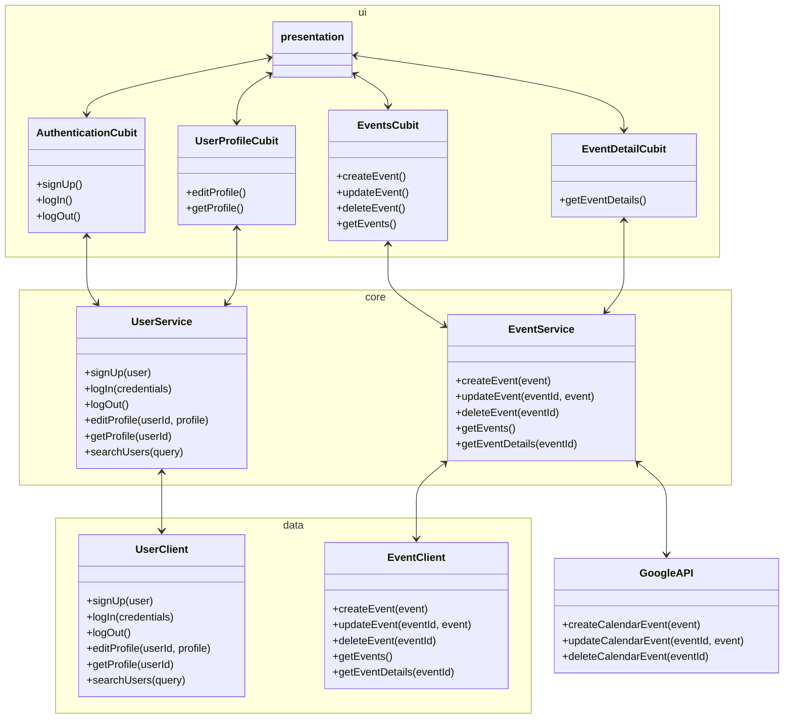

# Contributing to the project

## Global Architecture

The project is divided into three main layers: `ui`, `core`, and `data`. Each layer has its own
responsibilities:

This architecture allows us to write flexible code in the services, which can be used by multiple
features.

## Requirements

New features adhere strictly to the global architecture which means:

- The feature has its own view
- If the feature needs state, it is managed by a `Cubit` (UI)
- Business logic for the feature is contained within `Services` (Core)
- New clients are in the data folder
- New clients and services are registered in the dependency injection solution (`IoC`). This can be
  found in the `bootstrap.dart` files.

To ensure that your feature is responsive, you *must* at least write a `Bloc Test` for the feature.
Many examples can be found in the `test` folder, and the `bloc_test` package is used for this.