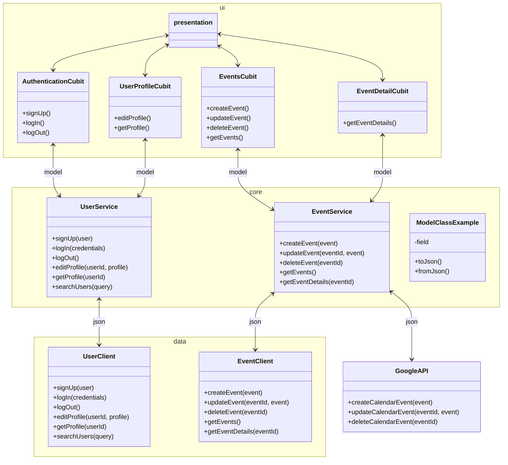
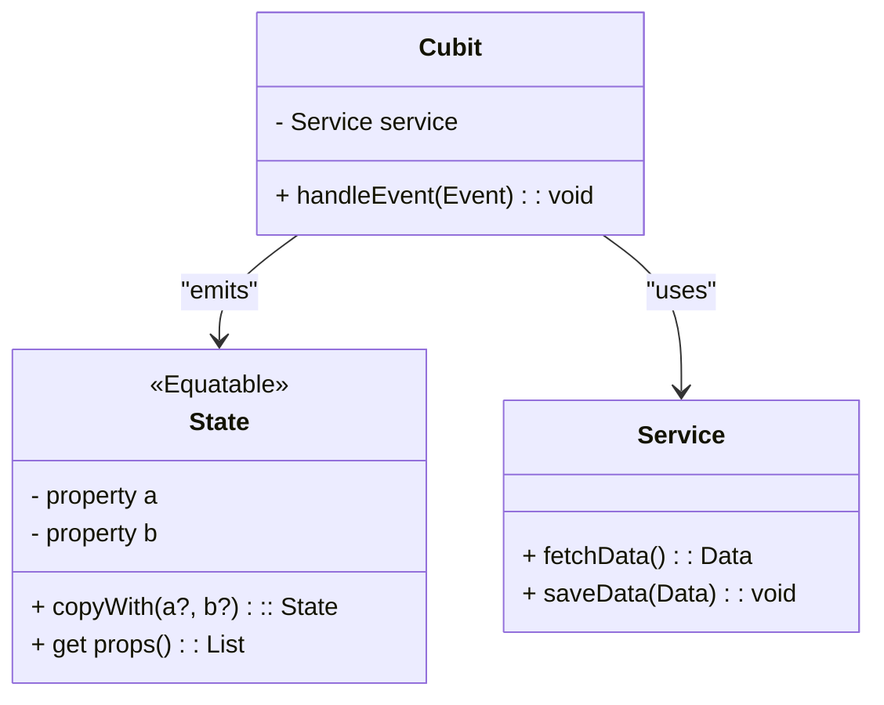

# Technical Design Document

## 1. Overview

This document will lay out the architectural and technical concepts that will be the foundation of this app. An overview of the architecture will be laid out, then starting from the connection with the backend this document will guide the reader through the architectural layers all the way to the UI.  

## 2. Architectural Overview

During the prototyping phase a lot of pain was felt when it comes to structuring the application. The biggest issue that came up was separating the different kinds of code a modern flutter application requires. Widget code, state management, business logic, data fetching, the list went on. The choices on why we chose this structure have been documented elsewhere, here we will outline how we are going to apply the techniques.

### 2.1 Folder structure

**UI (Presentation) Layer**

```
features/
├── feature/
|   ├── cubit/
│   │   ├── feature_cubit.dart
│   │   └── feature_state.dart
│   ├── view/
│   │   └── feature_view.dart
│   ├── feature_specific_widgets/
│   │   └── a_feature_widget.dart
```

**Core Layer**

```
core/
├── services/
│   ├── service_a.dart
│   └── service_b.dart
├── models/
│   └── model_a.dart
├── other_shared_functionality/
│   └── config_manager_example.dart
```

**Data Layer**

```
data/
├── clients/
│   ├── client_a.dart
│   └── client_b.dart
```

This folder structure leaves out the following aspects that are traditionally found in clean architecture one way or another:

- Repositories / data source abstraction
- Data transfer objects

We are leaving out the repositories because they are mainly used to abstract our data sources, thus making it easier to change the concrete implementations later. Because of the short development cycle, this effort would not impact the final product. 

Data transfer objects are traditionally their own entities, but again this is to tie them to a specific data source. We are going to try and add the data transfer functionality (translating to and from `json`) to the model classes themselves. Below is an example of how clean architecture might look for our application.



## Procuring Data

Aiming for the simplest approach, the basic `http` package for interacting with the backend, and a service will be responsible for calling the client and performing any other business logic. For each 'entity' a `client` and `service` will be made. 


## State Management




